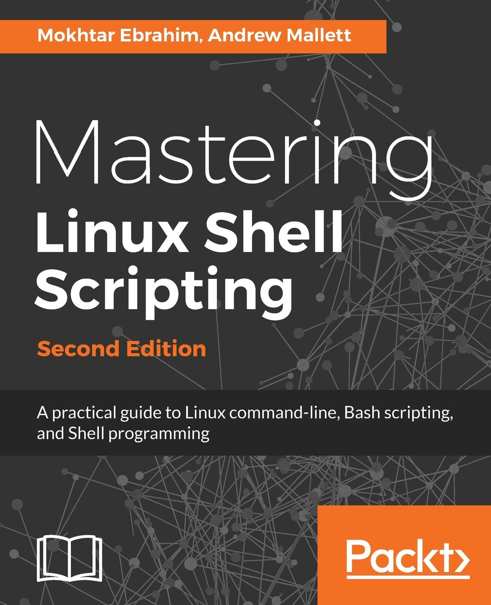

# Mastering Linux Shell Scripting

## Overview
My rendition of the topics and scripts covered in the book "Mastering Linux Shell Scripting: Second Edition"
by Mokhtar Ebrahim and Andrew Mallett.

## Chapters
Scripts or concepts covered in each chapter.  
Each chapter has it's own README which goes more in-depth on the chapter topics and scripts created.

## Book information
Name: Mastering Linux Shell Scripting  
Author: Mokhtar Ebrahim, Andrew Mallett  
Publisher: Packt Publishing  
ISBN: 978-1-78899-055-4  
Cover:  

